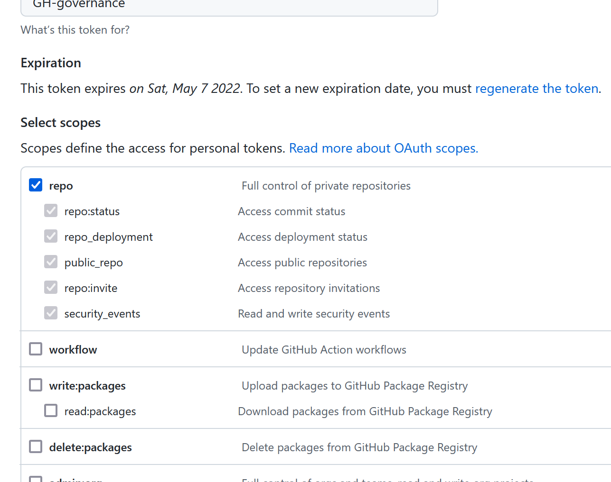

# Demo repo for technical Interview

This repo contains all the content regarding the interview exercise

## Structure of the repository

1. A PowerPoint presentation explaining the solution (customer-facing) is located in **Presentation** folder
2. A web component to handle webhook is in **web-component** folder which contains a detailed description on how to deploy it
3. All scripts handled by workflows are located in the workflows folder

## Prerequisites

You'll need to create a PAT Token with admin access on the organization. It will be used by GitHub Action workflows (injected as secret "**PAT**") and by the web component (injected as env variable named **GITHUB_API_TOKEN**).

It only requires a limited scope (repo).

