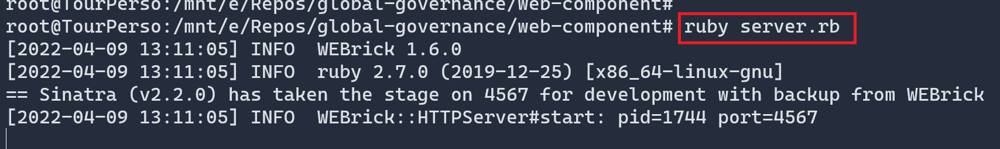
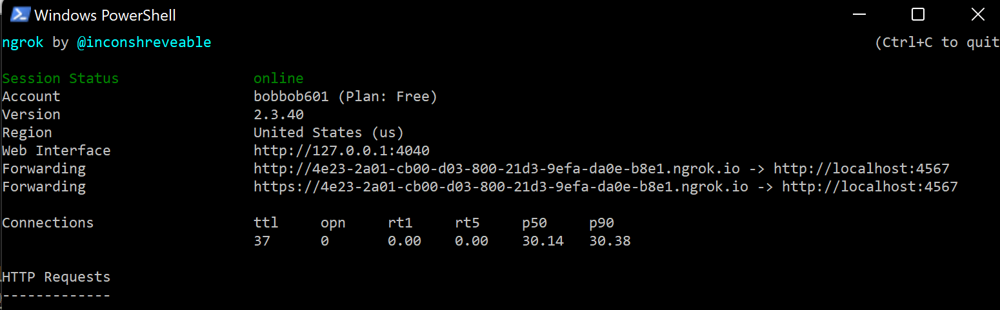
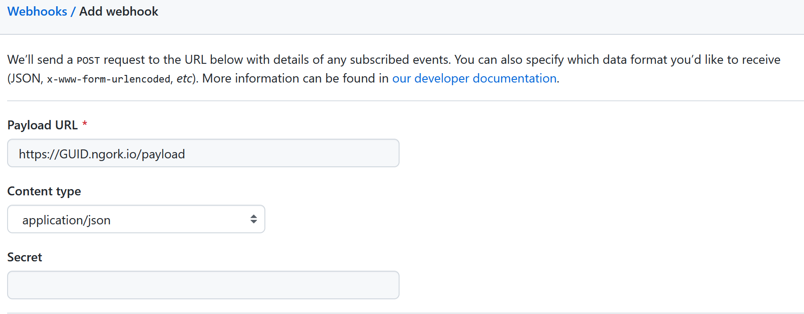
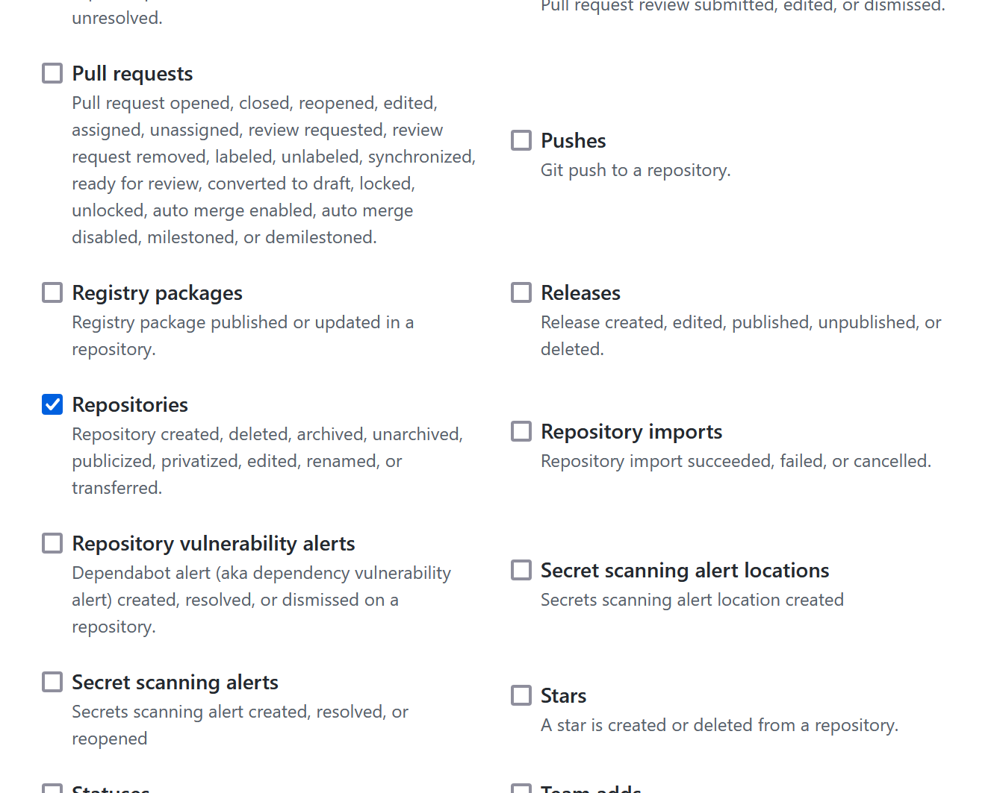
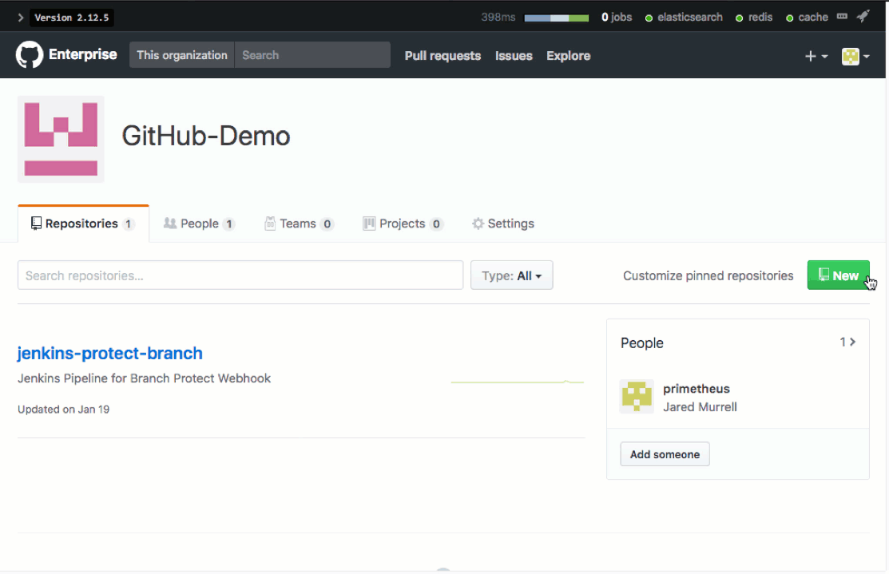

# web component

This web component is responsible to receive the webhook call and act accordingly. In this case, when a repository is created, the component will ensure that a default branch is created and will enforce branch protection on it. Then it will create an issue on the same repo.

## Pre requisites

Several components will be used:

- ngrok (optional if you host you ruby App on Internet): to expose the component on Internet (see [documentation](https://ngrok.com/download))
- ruby: the component is developed using Ruby and the Sinatra framework.
- octokit: to simplify interaction with GitHub API, the component use the [octokit framework](http://octokit.github.io/octokit.rb/)

1. Install Ruby

``` sh
apt install ruby
apt install ruby-dev
apt install ruby-bundler
```

2. Install dependencies

``` sh
bundle
```

## Configuring component

1. Run component

``` sh
ruby server.rb
```



2. Proxy it using Ngrok (using the same port number that the one used by ruby application)

``` sh
ngrok http 4567
```



### Configuring webhook

You must configure a organizational webhook, configure to send events regarding repositories to our component


1. Go to to your [org settings](https://github.com/organizations/lgmorandOrg/settings/hooks)

2. Click on **"Add webhook"**

3. Add the URL of the web component.Ensure payload is send using JSON format

> The web component is listening on "/payload" and thus it must be added to the ngrok URL.

(Optional) You can define a secret but you'll have to set it on the webhook and in the web component using SECRET_TOKEN env variable



4. Filter the events to only select "repository"



That's it. When a new repository is **created**, an event will be sent to the component.

> Note: some events (repo deletion/update/etc) will be sent to the component too but it has been configured to disregard them.


